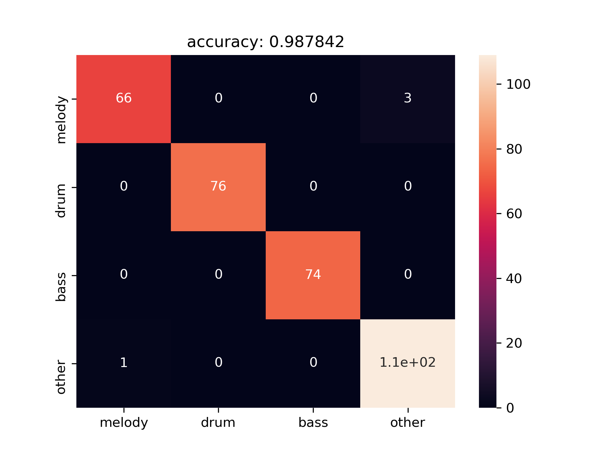
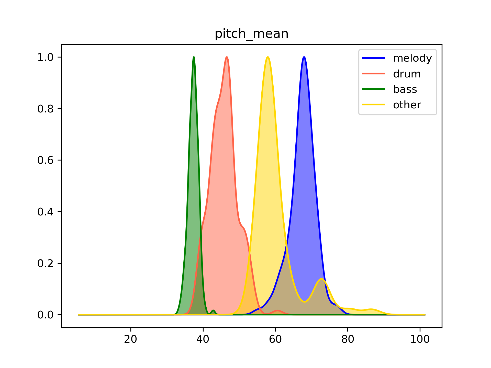
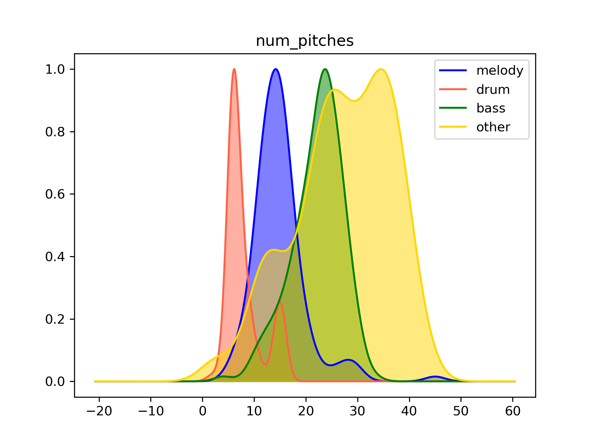
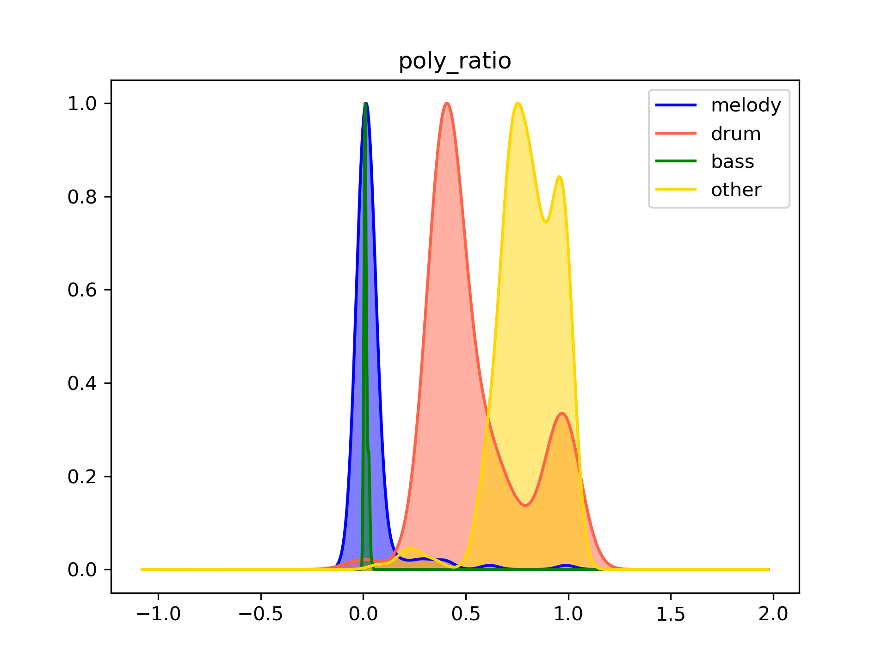

# Midi-Track-Idenfication

Categorize tracks of midi files into four classes:  
* Melody
* Drum
* Bass
* Other

There are two main goals of this task:
* Data Cleansing:  
    * The track names in midi files usually have less useful meaning.
    * The program number and channel number are not in GM Midi format.
* Separate perceptually melodic **tracks** based on hand-labeling data

Note that there are possible one more melodic track in one song.

---

## Result
### Accuracy
* Train: 1.0
* Test: 0.98

### Dataset
* Jazz Realbook
* Total: 1094 songs (7:3)
    * Train: 765
    * Test: 329

### Conception
* Feature Extraction
* Classification (Random Forest, n_estimation=100)

### Figures

* Testing Stage


* Feature Distribution




*For further understanding, please refer to [here](notebook/Analysis.ipynb)*
---
## Usage

```bash
python compile_dataset.py
python compile_feature.py
python analysis.py
```

To run testing on self-prepared data, please check out the [test.py](test.py)